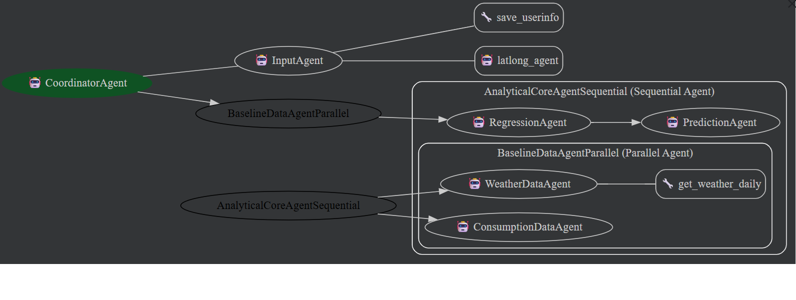

# SynergyBase Energy Baseline Agent

The project Energy Baseline Agent automates energy baseline creation and testing the regression equation representing the baseline

## Overview 

*Energy Baseline Agent*

An energy baseline is the reference level of energy consumption (or demand) against which future energy performance is measured. It represents the "business-as-usual" consumption of a facility, system, or equipment before energy conservation measures (ECMs) are implemented. Typically, energy consumption of a facility or a building depends on weather conditions. Energy Baseline Agent (referred as the baseline agent) automates calculating energy baseline.

## Problem Statement

It is a regulatory requirement to implement energy optimization measures and report energy savings over a period. Finding baseline is the first step to achieve energy savings and ultimately reduce overall carbon emissions. Manually calculating energy baseline is cumbersome, time consuming and error prone. Typically excel based tools are used in the industry for baseline calculations. Such tools are clunky and do not scale.

## Solution Statement

Automation of baseline calculations would reduce manual efforts, improve accuracy of baseline calculations and energy savings. Such a solution would improve regulatory compliance. The solution would involve

- Gathering energy consumption data either through smart energy meters or utility bills
- Weather data from weather station or sites like openmeteo.com or tomorrow.io
- Use historical weather and energy consumption data to run a regression analysis
- The regression equation then can be used to forecast the baseline consumption and compare it with the actual to find out savings

The agentic solution involves creating composable architecture of hierarchy of various autonomous agents using google ADK to perform these steps. The solution is such that it can be extended to introduce newer agents to handle different flavours of energy baseline. Additionally complete automation of data and analytics pipeline is possible. Thus, it is possible to quickly configure a custom baseline solution to cater to exact requirements of a specific facility/building.

## Architecture



The actor in this use case is a facility/building manager who is responsible for calculating baseline and report savings. The baseline agent is the fundamental building block of the energy optimization, measurement and reporting process. At high level baseline creation involves following steps

- Taking and validating user input
- Execute Data Pipeline
- Execute regression pipeline

These steps have been implemented by bunch of agents assigned with specific responsibilities. The baseline agent has been implemented as per multi agent architecture pattern using Google ADK

### Coordinating baseline creation flow (coordinator_agent)

The coordinator agent is a top-level manager agent responsible for delegating the work to agents who specialize in specific tasks. The coordinator agent takes the overall responsibility of creating the baseline. This agent implements subagent pattern. It orchestrate the tasks to two subagents input_agent and analytical_core_agent

### Greeting and User Inputs - Input Agent (input_agent)

This agent greets the user and prompts the user to provide name, location, baseline dates. It makes fuzzy name match for the input given for city name and ensure that the dates are in past. These user inputs are saved to state and then used by the subsequent agents.

### Finding Latitude and Longitude of a location (latlong_agent)

To find weather data of a location/city geo-location details are required. This agent gives latitude and longitude of city for which user wants to compute baseline and is saved in state variable by input agent. Here agent as a tool architecture pattern has been implemented. Latlong agent works as a agent tool for input_agent

### Execute Analytics - Baseline sequential agent (analytical_core_agent)

This agent implements sequential workflow pattern offered by ADK. It executes data pipeline, followed by analytics pipeline. Underneath the sequential agent is a parallel agent which executes data pipeline. Output of data pipeline is used to create energy baseline by the regression and prediction agent which are subsequent agents in the sequential pipeline.

### Generate data for regression (baseline_data_agent_parallel)

This agent implements parallel workflow architecture pattern offered by ADK. As data operations are time consuming and can be performed independently in this case, parallel workflow pattern of ADK has been implemented. Underneath the parallel agent following two agents operate - weather_data_agent and consumption_data_agent

### Fetching weather data (weather_data_agent)

This agent is responsible for fetching weather data from the wesite openmeto.com by making an API call by passing latitude and longitude of the city specified by user and stored in the state variable by latlong agent. It generates output in the specified schema

### Synthetic data creation for energy consumption (consumption_data_agent)

This agent generates daily energy consumption data in the specified output schema at a city location which is stored in the state variable which is taken from user input.

### Run regression (regression_agent )

This agent fits multi linear regression equation between energy consumption data (dependent variable) and weather data (independent variable).

### Predict consumption (prediction_agent)

This agent completes the analytical flow by running a test on the regression equation using a sample dataset.

### Essential Tools and Utilities


- Agent Tool - latlong_agent

latlong agent works as a tool for input agent. Here agent as a tool pattern has been implemented.

- Function Tool - save_user_info

Here a custom tool has been developed by implementing function tool pattern for input agent. This tool is responsible for assigning the dates to the right date variables and store them in the session state variables along with other user information like city and baseline start and baseline end date mentioned by user in a response to the greeting prompt of input_agent.

- Built In Code executor

Built in code executor pattern has been implemented for regression and prediction agent. This ensures that agent does not hallucinate and computes a multilinear regression equation. In sequential pipeline this equation is then consumed by prediction agent which also implements built in code executor offered by ADK.

Rather than writing a specific function for regression analysis (model build and test) built in code executor is used so that if the project is to be enhanced for supporting different / additional independent variables there will little changes to regression and prediction agent

## Instruction for Setup

### Prerequisites
- Python version 3.11.9

### Setup
- Create a clone from git repository by executing following command
```
$ git clone <https://github.com/AnandaD-source/ADKCapstone.git>
```
- Goto the folder of the source code. E.g. ADKCapstone by executing following command
```
$ cd ADKCaptstone
```
- Initialize python virtual environment by executing following command
```
$ python -m venv .venv
```
- Activate python environment by executing following command
```
$ .\.venv\Scripts\activate
```
- Install the dependencies from requirements.txt by executing following command

```
$ pip install -r requirements.txt
```

- Configure environment variable for GOOGLE_API_KEY. Ensure .env file exists in the root of the clone e.g. in ADKCapstone folder

### Execution

#### CLI 
To test the application from CLI command execute main.py by giving inputs. E.g. execute following command

```
$ python main.py --name ananda --city mumbai --baseline_from_date 2025-11-09 --baseline_to_date 2025-11-24
```
The command line arguments for the CLI are as follows:
```
usage: main.py [-h] --name NAME --city CITY --baseline_from_date
               BASELINE_FROM_DATE --baseline_to_date BASELINE_TO_DATE

Run multiple regression prediction app.

options:
  -h, --help            show this help message and exit
  --name NAME           User's name
  --city CITY           User's city
  --baseline_from_date BASELINE_FROM_DATE
                        Baseline start date in YYYY-MM-DD format
  --baseline_to_date BASELINE_TO_DATE
                        Baseline end date in YYYY-MM-DD format
```

#### Web 

To test the agent from ad web execute following command
```
$ adk web
```
It will open adk web at the following URL - <http://127.0.0.1:8000>

Do following in browser at the above URL

 - Say Hi to coordinator_agent. The agent will greet and prompt to provide name, city , baseline start date and baseline_end date. Provide following sample input- name-Ananda city- Mumbai , baseline from date: 2025-11-09, baseline end date 2025-11-24

# Project Link 

<https://github.com/AnandaD-source/ADKCapstone.git>
